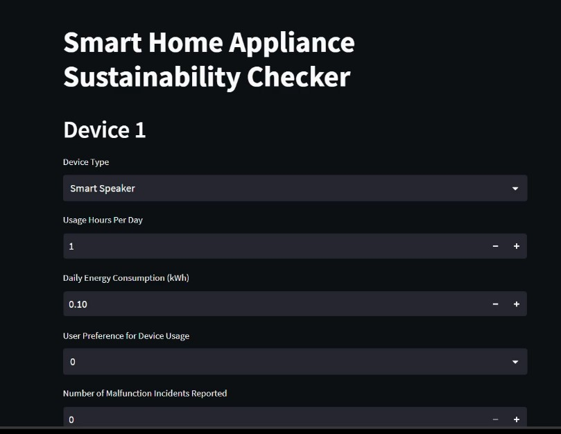
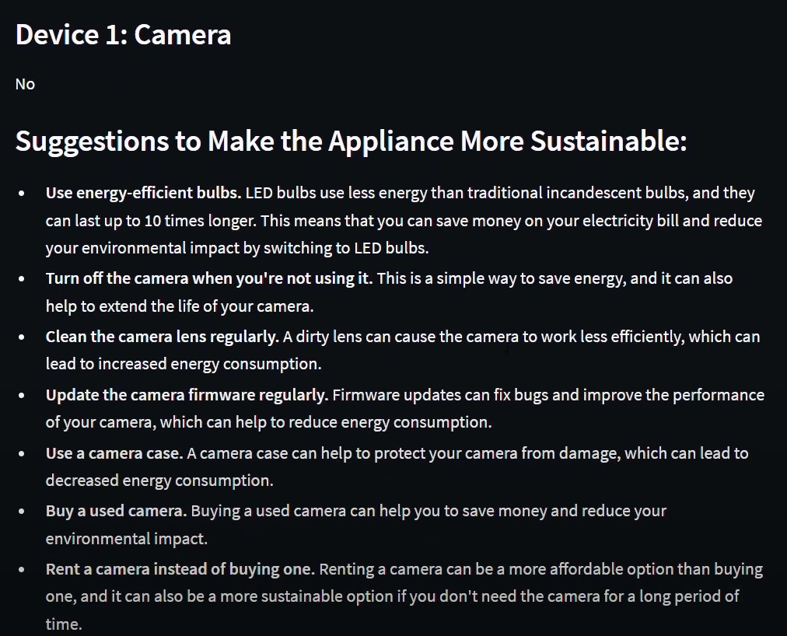
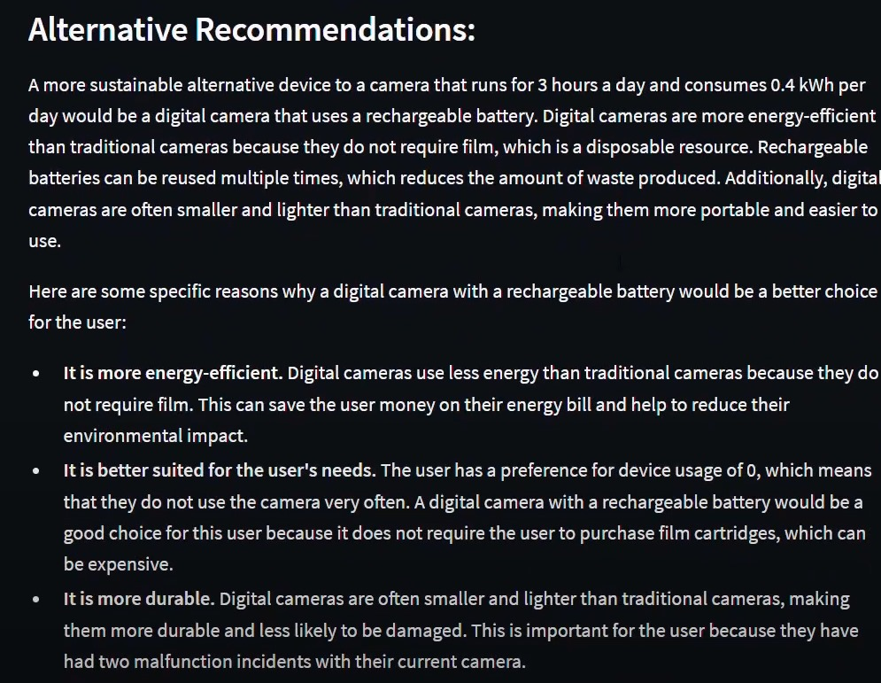

# Abstract
The AI-Driven Energy Saving Advisor for Smart Homes is an innovative application designed to help homeowners optimize their energy usage. The application leverages advanced machine learning (ML) and deep learning (DL) models to analyze data from smart home devices, assess their energy efficiency, and provide personalized recommendations. This not only helps in reducing electricity bills but also promotes sustainable living.

# Problem Statement
Many homeowners are unaware of the energy consumption patterns of their household appliances, leading to inefficient usage and higher electricity bills. The lack of accessible tools to evaluate and optimize energy efficiency contributes to this problem, making it difficult for individuals to take proactive steps toward energy conservation.The project aims to develop AI models to predict the sustainability and also integrate LLM which is fine tuned to give suggestions to the user.

# Solution
Our solution addresses inefficient energy usage in households by developing a comprehensive AI-driven application. 
This application empowers homeowners with actionable insights and recommendations to optimize energy consumption through the following key components:

#### 1. Data Collection
   The application gathers detailed information from smart home devices, including appliance features, real-time energy consumption, and user preferences. 
   This data is crucial for assessing energy efficiency and identifying optimization opportunities.
   

#### 2. Sustainability Evaluation
   Using advanced machine learning models, the application analyzes usage patterns and assesses each device's efficiency. It predicts whether a device is operating efficiently or contributing to energy waste, continuously improving its predictions over time.

#### 3. Personalized Recommendations
The application provides three types of personalized suggestions using a combination of:
* Individual Appliance Optimization: 
Tailored advice to improve the energy efficiency of each specific device.
* Alternative Device Suggestions: 
Recommendations for more energy-efficient devices to replace less efficient ones.
* Comparison of All Devices: 
A comprehensive analysis that compares all entered devices to highlight the most and least efficient options.

The application provides tailored suggestions using a combination of:
* LangChain: 
To chain together different LLM (Large Language Model) operations.
* Google PaLM API: 
To generate personalized, AI-driven recommendations.




#### 4. Data Visualization and Insights:
   The application incorporates advanced visualization plots to present energy consumption data in an intuitive and actionable manner. These visualizations include graphs and charts that help users easily understand their energy usage patterns, identify trends, and assess the impact of their energy-saving actions. 
   
   

#### 5. Interactive User Interface
   The user-friendly web interface developed with Streamlit allows users to view data, receive insights, and track energy usage. The integrated chatbot offers real-time support, guiding users through the process of implementing energy-saving measures.

# Technologies Used :
* Streamlit: Builds and deploys an interactive and user-friendly web application, providing real-time updates and visualizations to enhance user engagement and decision-making.

* Python : Handles data analysis and implements machine learning models to assess appliance efficiency and optimize energy consumption, serving as the core language for processing and integration.

* Google PaLM API : Utilizes advanced language models from Google to generate personalized, AI-driven recommendations for optimizing household appliances. Enhances the application’s ability to provide relevant and actionable advice based on user-specific data.

* LangChain 88 :  Chains Google PalM large language model(LLM) with other components to generate personalized suggestions for improving appliance sustainability, enabling tailored recommendations based on user data.

* Visualization Libraries (e.g., Matplotlib, Plotly): Create interactive plots and charts to visualize energy consumption patterns, helping users understand and track their energy-saving efforts.

# Challenges we ran into :

Data Collection: Gathering relevant and high-quality data from smart home devices was time-consuming and required extensive research. Integrating diverse data sources and ensuring data consistency posed significant challenges.

Model Training: Ensuring our machine learning model was accurate and reliable involved multiple iterations and fine-tuning. This process required extensive experimentation and validation to achieve optimal performance.

Combining Manual and LLM Recommendations: Integrating manual suggestions with those provided by the LLM was challenging. We needed to ensure consistency and relevance between manually crafted advice and AI-driven recommendations, requiring careful design to present a unified and actionable set of recommendations to users.

# Accomplishments We're proud of:
* High Model Accuracy: Achieved an impressive accuracy rate of 95% with our machine learning model, ensuring reliable assessments of appliance efficiency and effective energy optimization.

* Comprehensive Solution: Created a platform that comprehensively addresses energy efficiency by not only evaluating appliance performance but also providing actionable recommendations for improvement.

* Personalized Suggestions:
Tailored Advice: Combined manual and AI-driven recommendations for personalized suggestions based on user data.
Integrated LLM Insights: Used Google PaLM API and LangChain to deliver contextually relevant advice tailored to each user.
Actionable Recommendations: Offered specific steps to optimize energy consumption, including appliance settings, usage habits, and upgrades.

* User-Friendly Interface: Developed an intuitive and visually appealing platform using Streamlit, allowing users to easily navigate and interact with the application. The interface includes real-time updates and clear visualizations.

# What we learned :
* Data is Key: High-quality, relevant data is crucial for developing effective machine learning models and achieving accurate results.
* User-Centric Design: Prioritizing user experience and incorporating feedback is essential for creating a successful and intuitive application.
* Collaboration: Leveraging each team member's strengths and working together fosters innovation and leads to more effective solutions.

# What's Next for the Smart Home Device Sustainability Checker
* Expanding Device Compatibility: Integrate additional types of smart home devices to broaden the scope of energy efficiency assessments and provide a more comprehensive evaluation.

* Enhancing Features: Introduce more detailed insights and personalized recommendations based on in-depth analysis of user behavior and preferences, aiming to improve the overall user experience and effectiveness of the application.

# Running the Streamlit App

1. You can install dependencies using pip:

```bash
pip install -r requirements.txt
```

2. Run the Streamlit App Use the Streamlit command to run the application.

```bash
streamlit run app.py
```